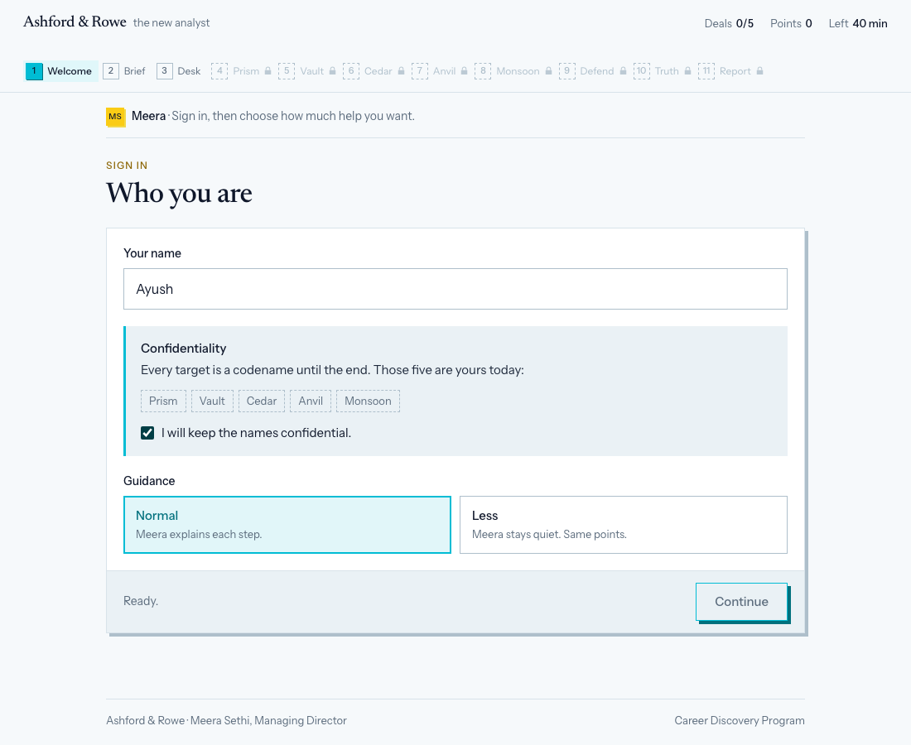
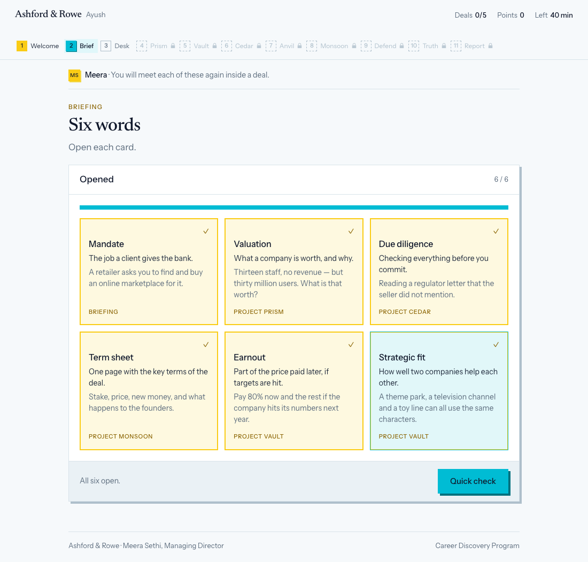
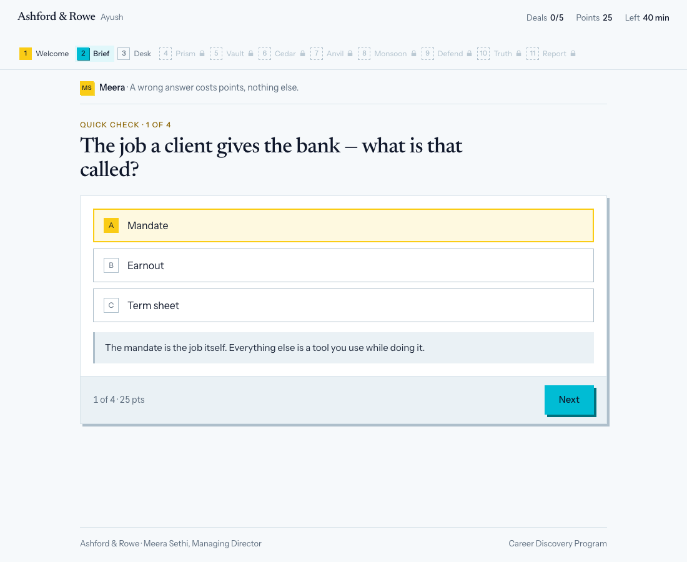
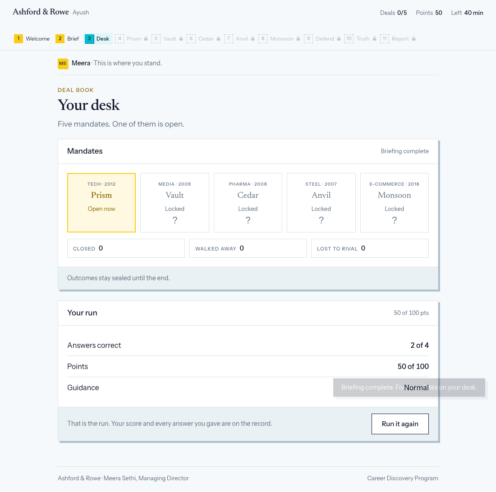

# Investment Banking Simulation

A working build of the opening stages of an Investment Banking simulation, made for FinTree's Career
Discovery Program from a written experience brief they supplied.

**Welcome → Briefing Room → Deal Book.**

It is a Flask app. The rules live in Python; the browser only draws what it is given.

```bash
pip install -r requirements.txt
python app.py
# -> http://127.0.0.1:5057
```

---

## Screens

| | | |
|---|---|---|
|  |  |  |
| **Welcome.** The run in three lines. | **Sign in.** Name, confidentiality, guidance. | **Briefing room.** Six words, each with a meaning and an example. |
|  |  | |
| **Quick check.** The question is the heading. | **Deal Book.** Five mandates, one open, and the run's score. | |

---

## What is built

| Stage | What it contains |
|---|---|
| **1 Welcome** | Title, the one-minute tour, sign in (name, confidentiality note, guidance mode), what bankers do, your job today |
| **2 Brief** | Six word cards, each with a plain meaning, a one-line example and the mandate it matters in. Then four questions, 25 points each |
| **3 Deal Book** | Five mandates — codename, sector, year, status — the receipt counters, and the run's score |

The deal engine starts at Project Prism. The desk is where this build hands over.

---

## Why there is a server

The first version of this was one HTML file and three scripts, and it ran by double clicking it. That
version still exists — `git checkout static-js-v1` — and it is a perfectly good demo. It is also a
demo whose scoring is a suggestion: every gate, every correct answer and every point total lived in
JavaScript the player could read and edit in devtools.

A simulation that grades you cannot be trusted to the thing being graded. So the logic moved to
Python, and the browser was demoted to a view layer.

| | Static build (`static-js-v1`) | This build |
|---|---|---|
| Where the rules live | `ib.js`, in the browser | `sim/rules.py`, on the server |
| What the browser sends | nothing — it *is* the engine | an action **name** and a small payload |
| What the browser receives | everything, always | only the current screen, with the answer withheld |
| The answer key | present in the payload | absent until the question is answered |
| Scoring | computed client-side | computed server-side, stored server-side |

That last column is the whole point, and it is testable. See **The privacy boundary** below.

---

## How it is put together

```
app.py                 two endpoints and an in-memory session store
sim/content.py         loads and validates the briefing JSON at import time
sim/state.py           the shape of a run, and the clock
sim/rules.py           every gate, every score, every transition  <- the authority
sim/views.py           state -> render payload                    <- the privacy boundary
content/briefing.json  the words, the questions, the deal book
templates/index.html   the shell
static/ib.js           the view layer. No rules. No answers.
static/ib.css          the whole design system
static/tokens.css      foundations: type, reset, focus, reduced motion
tests/test_sim.py      50 tests, including the privacy assertions
```

Two endpoints do all the work:

```
GET  /api/state     the full render payload for the current player
POST /api/action    {action, payload} -> the new payload plus any events
```

The browser sends `{"action": "brief.answer", "payload": {"index": 2}}`. It does not send
`"correct": true`. It has no way to say how many points it earned, because points are not a field it
can write — they are computed in `sim/rules.py` and stored on the server.

A few decisions worth naming:

**The current screen is the only screen in the payload.** A screen that is not the current one is not
hidden with CSS; it is absent from the response. The quiz ships one question, not four.

**Content is data, validated at boot.** The briefing is one JSON file with no logic in it. A malformed
file — a duplicate id, an `answer` that is not an option, two mandates open at once — raises at import
time, so it fails at startup rather than halfway through someone's run.

**The client never rebuilds a payload.** Buttons carry their payload as a JSON attribute
(`data-payload`) written by the server. There is no id-whitelist on the client reconstructing
arguments, which removes a whole class of drift between the two sides.

**The rail shows all eleven stages, and the last eight are locked.** A player can see the shape of
the run and where they are in it. `locked` is deliberately a different state from `upcoming` — an
upcoming stage is one the player is going to reach, a locked one is not open to them at all — and a
locked chip is a dashed number, a name and a padlock with no `data-action` on it, so there is nothing
for the client to post. The server sends no hint about what is behind them.

**Port 5057, not 5000.** On macOS, AirPlay Receiver (`ControlCenter`) already listens on 5000 and
answers with a 403 before Flask ever sees the request. `PORT=...` overrides it.

**The clock runs but never blocks.** The brief specifies a global clock *and* a per-deal
countdown, but defines an expiry rule for only one of them (the briefing). This build shows the
global clock counting down from 40 minutes and clamps at zero without ending the run. A reviewer who
leaves the tab open still sees the whole flow.

**Sessions are in memory, on purpose.** A dict in `app.py` is the smallest thing that demonstrates
server-authoritative state and needs no setup. It is not what you would ship: a restart drops every
run, and it does not work across more than one process. Redis or a table is the real answer.
`SECRET_KEY` is random per boot unless `FINTREE_SECRET_KEY` is set, which makes the same point from
the other direction.

---

## The design

The interface is built to be read in one pass. Three rules did most of the work.

**One idea per screen.** A heading and, at most, one supporting line. The old build spent five text
blocks before the player reached the question — the number twice, the points three times, and the
progress three times. The question is now the heading and the chrome sits around it.

**The accent means something.** Yellow is spent on state: a word you have opened, the mandate that is
open, the correct answer, a low clock. Cyan is spent on action: primary buttons, the active stage, the
progress bar. Because each colour has one job, a glance at the page tells you where the player is.
A wrong answer is red regardless of the brand, because "wrong" has to survive whatever the theme is
doing.

**Nothing on screen is developer-facing.** There are no screen numbers, no build-stage notes, and no
apology for what is not built. A player should not be able to tell that a stage is missing; they can
only tell that the desk has five mandates and one is open.

### Form

The app fills the viewport: a sticky topbar, a content column that grows, and a footer pinned to the
bottom, so a short screen has no dead space under it. The page behind the cards is white at 96%, so a
white card reads as sitting on something rather than floating on a void.

Square corners, a hard 4px offset shadow with no blur, and one 120ms colour transition on interactive
surfaces. A card reads as a printed card rather than a floating panel. The single animation is the
toast, and `prefers-reduced-motion` stops all of it.

### The palette — 60 / 20 / 20

| Share | Colour | Where it goes |
|---|---|---|
| **60%** | white `#ffffff` | every surface — page, cards, topbar, footers |
| **20%** | cyan `#00bcd4` | action — primary buttons, the active stage marker, the progress bar, hover states |
| **20%** | yellow `#facc15` | state — opened words, the open mandate, the correct answer, Meera's mark, a low clock |

**Bright cyan forces one decision.** `#00bcd4` is a light colour. On white it reaches only 2.3:1, which
is fine for a button or a 6px progress bar and nowhere near enough for a sentence. So the brand splits
in two:

- `--c-30` (`#00bcd4`) is the **fill** — anything painted cyan
- `--c-30-ink` (`#00707d`) is the **text** — the same hue, dark enough to read on white at 5.8:1

And anything printed *on* cyan is dark ink, never white: `#0f172a` on `#00bcd4` is 7.8:1, where white
on it would be 2.3:1. That is why the primary button is both the loudest surface in the app and the
darkest text in it.

Yellow needed the same treatment once it moved from a single accent to a fifth of the interface:
`--c-10-ink` (`#8a6300`) is the hue darkened to 5.1:1 and carries any yellow that has to hold text.

**Red sits outside the ratio.** A wrong answer has to look wrong whatever the brand is doing, so
`--signal-risk` is untouched. It is a functional colour, not part of the theme.

**How it is implemented.** `static/tokens.css` holds foundations only — type, reset, focus, reduced
motion — and deliberately names no colour. The whole palette is one block at the top of
`static/ib.css`.
Nothing else names a colour: `ib.css` contains no stray hex outside that block, and `ib.js` contains
no colour literals at all. So the whole theme is one block, and retinting the app means editing it.

---

## The privacy boundary

The claim this architecture exists to support is: **a player who reads every byte the browser receives
still does not know the answer.** That is not a comment in the code, it is asserted.

`sim/views.py` withholds it:

```python
# The answer index is withheld until the question has been answered.
"correct_index": question["answer"] if answered else None,
"why":           question["why"]    if answered else None,
```

`tests/test_sim.py::TestPrivacy` reads the **raw response body** — the same bytes devtools shows — and
asserts, among others:

- the quiz payload carries `correct_index: null` and `why: null` before the answer, and the real values
  after
- a future question's prompt and explanation are not in the payload at all
- **no explanation appears in any response sent before its question was answered** — checked across
  every body of a full run, not just the one on screen
- the Deal Book repeats neither the prompts nor the explanations, and carries no field naming an
  outcome for any mandate
- one session cannot read another's state
- `ib.js` contains no copy of the answers, and no reference to any deleted deal action

Verified in a real browser as well: driven through a whole run with Playwright, the DOM mid-quiz
contained no `option--right` class, no `data-correct` attribute and no answer index, and the
explanation text appeared only *after* the question was answered.

---

## Running the tests

```bash
python -m unittest discover -s tests -v
```

50 tests, no server and no network required — they use Flask's test client. They cover the content
file, the stage gates, the scoring, the privacy boundary and the plumbing. The suite runs clean under
`-W error::ResourceWarning`.

---

## Defects found and fixed

Found by driving the build rather than by reading it. The first two were in the static version; the
rest were found by the test suite written for this one.

**1. The whole welcome stage was skippable.** `brief.open` set `stage = "brief"` with no check on where
the player was. One action name sent from the title screen jumped straight into the briefing room,
past the name and the confidentiality note — the two things the stage exists to collect. It now
requires a signed identity *and* the desk screen.

**2. The briefing room could be re-entered, wiping the quiz.** A follow-on from the first fix. `w_sub`
stays on `"desk"` for the rest of the run, so `brief.open` still looked legal from inside the briefing
room; a replay reset the sub-screen and discarded every answer behind it. The gate now checks the
*stage* as well as the sub-screen.

**3. The rail was not a rail.** `renderRail()` returned its cards as sibling elements. The page body
is a two-column grid, so the third card wrapped into row 2 *of the main column*. Fixed by wrapping the
rail in a single container.

**4. Disabled buttons failed contrast.** They were drawn with `opacity: .4` over a cyan fill, which
leaves grey text on pale cyan. They are now drawn rather than faded: no fill, no lift, muted label.

**5. A toast covered the content it was reporting on.** Toasts were centred at the bottom of the
viewport, which is where the content column is. Moved to the bottom-right.

**6. The app floated in the middle of the screen.** A 760px column on a 1100px viewport left dead
white on both sides and a large void under every short screen. The app is now a full-height flex frame
— sticky topbar, growing content column, footer pinned to the bottom — over a page tint a few percent
off white, so a card has something to sit on.

**7. The stage rail orphaned its last mark.** Eleven chips inside the 900px content column wrapped, and
"Report" dropped onto a second line on its own. The topbar now breaks out to its own wider measure so
all eleven sit on one line; below 1000px the locked stages drop their names and keep the number and the
padlock, and below 480px only the active stage keeps a name.

**8. A `pkill` in the restart script silently did nothing.** The process is `MacOS/Python app.py`, so
the case-sensitive pattern `python app.py` never matched and the old server kept the port while the new
one failed to bind. Caught because the live payload disagreed with the passing test suite. The preview
restart now kills by port.

---

## Known gaps

- **Project Prism is not built.** The Deal Book is where the run hands over to the deal engine.
- **The self-check is missing.** The brief asks for a five-skill self-check on the Welcome stage,
  unscored, compared against the report. It is the only unimplemented Welcome requirement.
- **The clock starts at sign-in.** The brief says it starts when the Briefing Room opens.
- **No quiz keyboard shortcuts.** Options are real buttons and tab fine, but there are no letter or
  arrow-key bindings.
- **Sessions are in memory**, so a restart drops every run. See above.

---

## Attribution

Built by Ayush Nimbhare as a portfolio piece, made for FinTree's Career Discovery Program from a
written experience brief they supplied. Everything here is written from scratch: the rules engine, the
content format, the design system and the 60/20/20 palette. Deal content is adapted from the brief,
which is based on real historical transactions — company names stay hidden behind codenames throughout,
the build never states an outcome, and nothing from FinTree's own platform or codebase is included.
Happy to remove or replace any of it on request.
