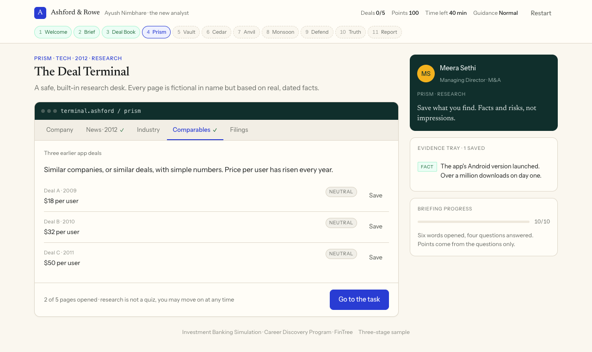
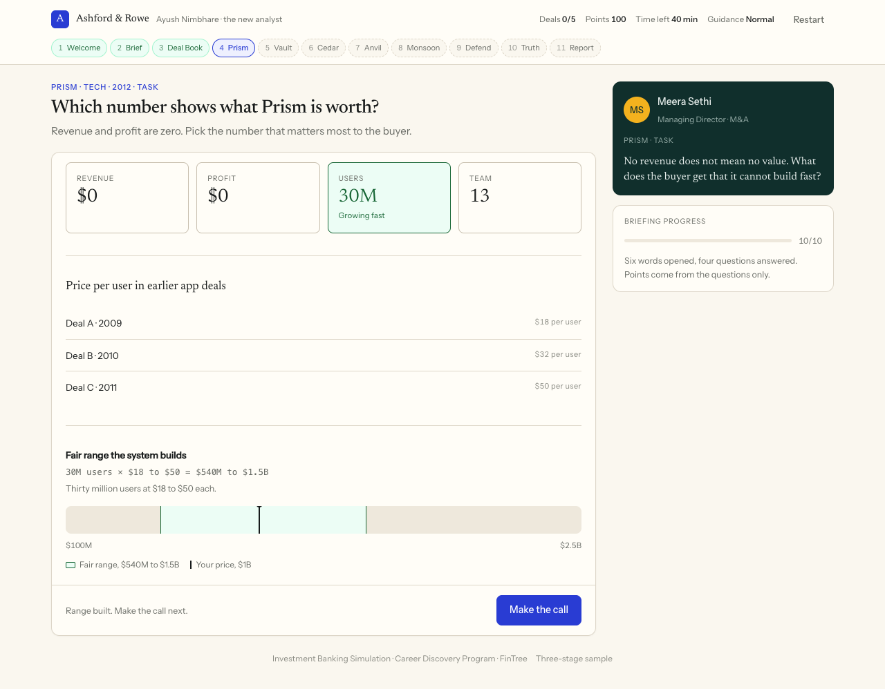
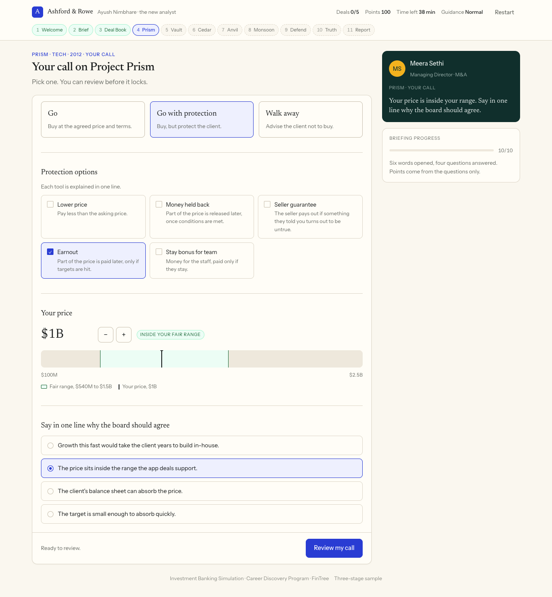
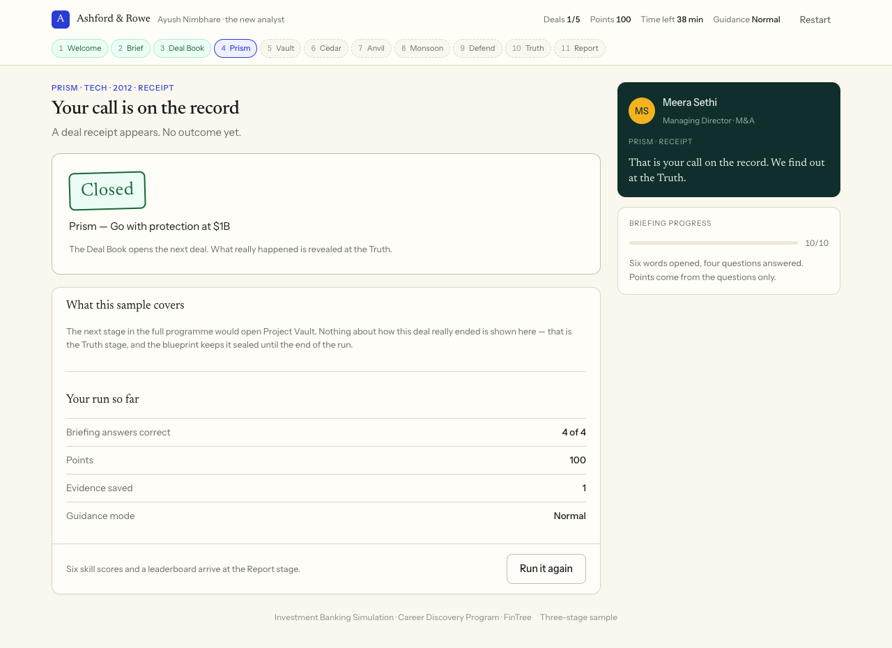

# Investment Banking Simulation — three-stage sample

A working sample of the opening stages of FinTree's Investment Banking simulation, built from
their `IB_Simulation_Experience_Blueprint` (20 pages, September 2026).

**Stage 1 Welcome → Stage 2–3 Briefing Room + Deal Book → Stage 4 Project Prism.**

It is a Flask app. The rules live in Python; the browser only draws what it is given.

```bash
pip install -r requirements.txt
python app.py
# -> http://127.0.0.1:5057
```

---

## Screenshots

| | |
|---|---|
|  |  |
| **Welcome.** Companion intro, then name, NDA and guidance mode. | **Briefing room.** Six deal words, each with a meaning, an example and the deal it matters in. |
|  |  |
| **Deal Terminal.** Company, news, industry, comparables, filings — with an evidence tray. | **The valuation.** Pick the metric, and the comparables build a fair range in dollars. |
|  |  |
| **Your call.** Go, go with protection, or walk away — with a price, a reason and a review. | **Receipt.** The deal closes. Nothing about how it really ended is shown. |

---

## Why there is a server

The earlier version of this sample was one HTML file and three scripts, and it ran by double
clicking it. That version still exists — `git checkout static-js-v1` — and it is a perfectly good
demo. It is also a demo whose scoring is a suggestion: every gate, every correct answer and every
point total lived in JavaScript the player could read and edit in devtools.

A simulation that grades you cannot be trusted to the thing being graded. So the logic moved to
Python, and the browser was demoted to a view layer. Concretely:

| | Static build (`static-js-v1`) | This build |
|---|---|---|
| Where the rules live | `ib.js`, in the browser | `sim/rules.py`, on the server |
| What the browser sends | nothing — it *is* the engine | an action **name** and a small payload |
| What the browser receives | everything, always | only the current step, with answers withheld |
| The answer key | present in the payload | absent until the question is answered |
| The right call | in the payload, unrendered | never serialised at all |
| Scoring | computed client-side | computed server-side, stored server-side |

That last column is the whole point, and it is testable. See **The privacy boundary** below.

---

## What is built

| Blueprint stage | Built? | What it contains |
|---|---|---|
| 1 Welcome | yes | Title, who you are (name, NDA, guidance mode), what bankers do, your job today |
| 2 Brief | yes | Six word cards, each with a plain meaning, a one-line example and the deal it matters in |
| 3 Deal Book | yes | Five mandates — codename, sector, year, status. Deals open one at a time |
| 4 Prism | yes | Brief → Deal Terminal research → valuation task → your call → review → receipt |
| 5–8 Vault, Cedar, Anvil, Monsoon | **no** | Shown as dashed chips in the stage rail |
| 9 Defend | **no** | |
| 10 Truth | **no** | |
| 11 Report | **no** | |

The stage rail shows all eleven so the shape of the full programme stays visible. The seven
unbuilt stages are dashed and carry a tooltip saying so. Nothing pretends to be finished.

## What is deliberately not built

The blueprint also specifies a leaderboard, a Deal Assistant, a voice CEO call, a counsellor/admin
app, PDF export and a one-minute tutorial video. None of that is here. It is not a matter of time
— it is a matter of what a sample is for. Everything above is *plumbing*; the stages themselves
are the *product*, and that is what a sample should show.

---

## How it is put together

```
app.py                 two endpoints and an in-memory session store
sim/content.py         loads and validates the JSON deals at import time
sim/state.py           the shape of a run, and the clock
sim/rules.py           every gate, every score, every transition  <- the authority
sim/views.py           state -> render payload                     <- the privacy boundary
content/*.json         one file per deal, plus the briefing room
templates/index.html   the shell
static/ib.js           the view layer. No rules. No answers.
static/ib.css          component styles
static/tokens.css      design tokens recovered from FinTree's live platform
tests/test_sim.py      52 tests, including the privacy assertions
```

Two endpoints do all the work:

```
GET  /api/state     the full render payload for the current player
POST /api/action    {action, payload} -> the new payload plus any events
```

The browser sends `{"action": "brief.answer", "payload": {"index": 2}}`. It does not send
"correct: true". It has no way to say how many points it earned, because points are not a field
it can write — they are computed in `sim/rules.py` and stored on the server.

A few decisions worth naming:

**The current step is the only step in the payload.** A future step is not hidden with CSS. It is
absent from the response. The quiz ships one question, not four.

**The fair range is derived, never stored.** `fair_range()` computes it from the same
`per_user × users_m` the screen displays, so the band drawn on screen cannot disagree with the
number being scored.

**Content is data, validated at boot.** Each deal is one JSON file with no logic in it. A
malformed deal — a duplicate id, an `answer` that is not an option, a slider that does not contain
the implied range — raises at import time, so it fails at startup rather than halfway through
someone's run.

**The client never rebuilds a payload.** Buttons carry their payload as a JSON attribute
(`data-payload`) written by the server. There is no id-whitelist on the client reconstructing
arguments, which removes a whole class of drift between the two sides.

**Port 5057, not 5000.** On macOS, AirPlay Receiver (`ControlCenter`) already listens on 5000 and
answers with a 403 before Flask ever sees the request. `PORT=...` overrides it.

**The clock runs but never blocks.** The blueprint specifies a global clock *and* a per-deal
countdown, but gives expiry behaviour for only one of them (the briefing, p6). This sample shows
the global clock, counting down from 40 minutes, and clamps at zero without ending the run. A
reviewer who leaves the tab open still sees the whole flow. In the full programme the expiry
policy needs deciding for every clock before build.

**Sessions are in memory, on purpose.** A dict in `app.py` is the smallest thing that demonstrates
server-authoritative state and needs no setup. It is not what you would ship: a restart drops
every run, and it does not work across more than one process. Redis or a table is the real answer,
and the README says so rather than pretending otherwise. `SECRET_KEY` is random per boot unless
`FINTREE_SECRET_KEY` is set, which makes the same point from the other direction.

---

## The privacy boundary

The claim this architecture exists to support is: **a player who reads every byte the browser
receives still does not know the answer.** That is not a comment in the code, it is asserted.

`sim/views.py` withholds three things:

```python
# The answer index is withheld until the question has been answered.
"correct_index": question["answer"] if answered else None,
"why":           question["why"]    if answered else None,
```

```python
# Note what is NOT here: deal['task']['right_call']. The outcome stays
# sealed until the Truth stage, which this sample does not build.
```

`tests/test_sim.py::TestPrivacy` reads the **raw response body** — the same bytes devtools shows —
and asserts, among others:

- the quiz payload carries `correct_index: null` and `why: null` before the answer, and the real
  values after
- a future question's prompt and explanation are not in the payload at all
- the metric grid is unmarked, and the fair range is absent until the right metric is picked
- **`right_call` never appears in any response**, across a full run
- the receipt reports what you decided, not whether it was right
- one session cannot read another's state
- `ib.js` contains no copy of the answers

Verified in a real browser as well as in the tests: mid-quiz, the DOM contained no `correct` class,
no `data-correct` attribute and no answer index, and the explanation text appeared only *after* the
question was answered.

---

## Running the tests

```bash
python -m unittest discover -s tests -v
```

52 tests, no server and no network required — they use Flask's test client. They cover the stage
gates, the scoring, the price clamping, the privacy boundary and the plumbing.

---

## Defects found and fixed

Four, all found by driving the build rather than by reading it. The first two were in the static
version; the second two were found by the test suite written for this one.

**1. The valuation task was a dead end.** The metric grid locked after the *first* pick — right or
wrong. Choosing "Revenue" by mistake disabled all four buttons and left the call button
permanently greyed out, so the player could never finish the deal. A wrong pick now shows in red
and releases the grid, so it reads as a retry rather than a wall; only the correct pick locks. The
bug was invisible in code review and obvious the moment it was clicked.

**2. The rail was not a rail.** `renderRail()` returned its cards as sibling elements. The page
body is a two-column grid, so the third card wrapped into row 2 *of the main column* — the
briefing-progress panel rendered underneath the content instead of beside it. Wrapping the rail in
a single container fixed it. Verified by measurement: `.body` now has exactly two children, the
rail sits at x=886 and the main column ends at x=862.

**3. The whole welcome stage was skippable.** `brief.open` set `stage = "brief"` with no check on
where the player was. One action name sent from the title screen jumped straight into the briefing
room, past the name and the confidentiality note — the two things the stage exists to collect. It
now requires a signed identity *and* the desk screen. Found by
`test_the_briefing_room_cannot_be_entered_without_signing`, which was written to check something
else entirely.

**4. A bad deal id returned a 500.** `content.get_deal()` raises `ContentError` — an error about
the *build* — but it was being called before the request was validated, so a client sending an
unknown `deal_id` got a stack trace instead of a refusal. `ContentError` and `ActionError` mean
different things and now stay separate: a bad request gets a 409 with a readable message.

---

## Attribution

Built by Ayush as a portfolio piece, from FinTree's Investment Banking blueprint. The design
tokens in `static/tokens.css` were recovered from FinTree's live platform so the sample reads as
track rather than as a pastiche. The deal content is adapted from the blueprint, which describes
real historical transactions; company names stay hidden behind codenames exactly as the blueprint
specifies, and the sample never states an outcome. Happy to remove or replace any of it on
request.
