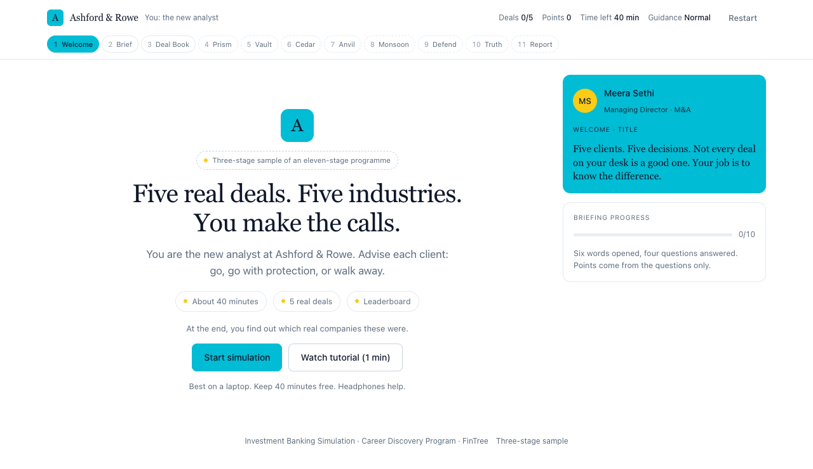
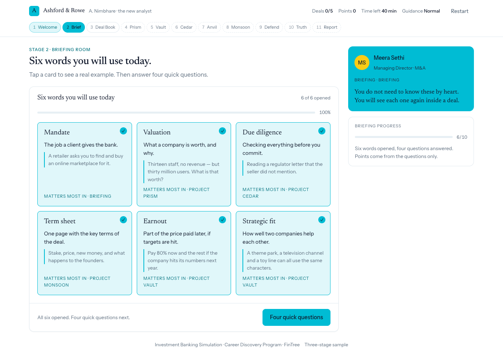
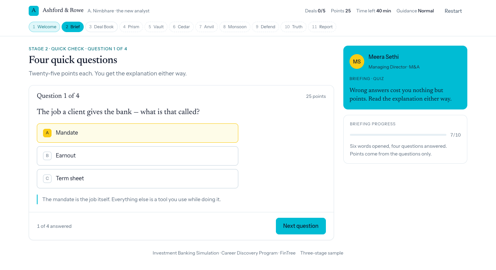
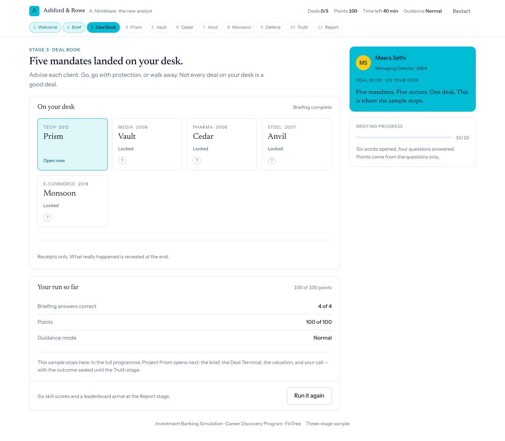

# Investment Banking Simulation — three-stage sample

A working sample of the opening stages of FinTree's Investment Banking simulation, built from
their `IB_Simulation_Experience_Blueprint` (20 pages, September 2026).

**Stage 1 Welcome → Stage 2 Briefing Room → Stage 3 Deal Book.**

It is a Flask app. The rules live in Python; the browser only draws what it is given.

```bash
pip install -r requirements.txt
python app.py
# -> http://127.0.0.1:5057
```

---

## Screenshots

| | |
|---|---|
|  |  |
| **Welcome.** Companion intro, then name, NDA and guidance mode. | **Briefing room.** Six deal words, each with a meaning, an example and the mandate it matters in. |
|  |  |
| **Quick check.** Four questions, 25 points each. The correct answer is the only yellow on the page. | **Deal Book.** Five mandates, one open, and the run's summary. This is where the sample stops. |

---

## Why there is a server

The earlier version of this sample was one HTML file and three scripts, and it ran by double
clicking it. That version still exists — `git checkout static-js-v1` — and it is a perfectly good
demo. It is also a demo whose scoring is a suggestion: every gate, every correct answer and every
point total lived in JavaScript the player could read and edit in devtools.

A simulation that grades you cannot be trusted to the thing being graded. So the logic moved to
Python, and the browser was demoted to a view layer. Concretely:

| | Static build (`static-js-v1`) | This build |
|---|---|---|
| Where the rules live | `ib.js`, in the browser | `sim/rules.py`, on the server |
| What the browser sends | nothing — it *is* the engine | an action **name** and a small payload |
| What the browser receives | everything, always | only the current screen, with the answer withheld |
| The answer key | present in the payload | absent until the question is answered |
| Scoring | computed client-side | computed server-side, stored server-side |

That last column is the whole point, and it is testable. See **The privacy boundary** below.

---

## What is built

| Blueprint stage | Built? | What it contains |
|---|---|---|
| 1 Welcome | yes | Title, who you are (name, NDA, guidance mode), what bankers do, your job today |
| 2 Brief | yes | Six word cards, each with a plain meaning, a one-line example and the mandate it matters in |
| 3 Deal Book | yes | Five mandates — codename, sector, year, status — and the run summary |
| 4 Prism | **no** | Was built, then cut. Recoverable: `git checkout with-prism-v1` |
| 5–8 Vault, Cedar, Anvil, Monsoon | **no** | Shown as dashed chips in the stage rail |
| 9 Defend | **no** | |
| 10 Truth | **no** | |
| 11 Report | **no** | |

The stage rail shows all eleven so the shape of the full programme stays visible. The eight unbuilt
stages are dashed and carry a tooltip saying so. Nothing pretends to be finished.

### Why Prism was cut

Project Prism — the brief, the Deal Terminal research, the valuation task, the fair range, the call
and the receipt — was built and working. It was removed on request, so the sample stops at the Deal
Book.

That is worth being straight about, because it moves the interesting part. The Deal Book is a
*listing*: five mandates, no decision. The stage where the server-authoritative design actually
earns its keep is the one after it, where the fair range is derived, the metric is scored and the
right call never leaves the server. What remains still demonstrates the architecture — the answer
key, the gates and the scoring are all still server-side, and the tests still prove it — but the
claim is narrower than it was.

The four-stage build is tagged, not deleted:

```bash
git checkout with-prism-v1     # four stages, Prism included
git diff with-prism-v1 --stat  # exactly what the cut removed
```

## What is deliberately not built

The blueprint also specifies a leaderboard, a Deal Assistant, a voice CEO call, a counsellor/admin
app, PDF export and a one-minute tutorial video. None of that is here. It is not a matter of time
— it is a matter of what a sample is for. Everything above is *plumbing*; the stages themselves
are the *product*, and that is what a sample should show.

---

## How it is put together

```
app.py                 two endpoints and an in-memory session store
sim/content.py         loads and validates the briefing JSON at import time
sim/state.py           the shape of a run, and the clock
sim/rules.py           every gate, every score, every transition  <- the authority
sim/views.py           state -> render payload                    <- the privacy boundary
content/briefing.json  the words, the questions, the deal book
templates/index.html   the shell
static/ib.js           the view layer. No rules. No answers.
static/ib.css          component styles, and the whole palette
static/tokens.css      design tokens recovered from FinTree's live platform
tests/test_sim.py      49 tests, including the privacy assertions
```

Two endpoints do all the work:

```
GET  /api/state     the full render payload for the current player
POST /api/action    {action, payload} -> the new payload plus any events
```

The browser sends `{"action": "brief.answer", "payload": {"index": 2}}`. It does not send
"correct: true". It has no way to say how many points it earned, because points are not a field
it can write — they are computed in `sim/rules.py` and stored on the server.

A few decisions worth naming:

**The current screen is the only screen in the payload.** A future screen is not hidden with CSS. It
is absent from the response. The quiz ships one question, not four.

**Content is data, validated at boot.** The briefing is one JSON file with no logic in it. A
malformed file — a duplicate id, an `answer` that is not an option, two mandates open at once —
raises at import time, so it fails at startup rather than halfway through someone's run. The deal
loader worked the same way and is in the tag.

**The client never rebuilds a payload.** Buttons carry their payload as a JSON attribute
(`data-payload`) written by the server. There is no id-whitelist on the client reconstructing
arguments, which removes a whole class of drift between the two sides.

**Port 5057, not 5000.** On macOS, AirPlay Receiver (`ControlCenter`) already listens on 5000 and
answers with a 403 before Flask ever sees the request. `PORT=...` overrides it.

**The clock runs but never blocks.** The blueprint specifies a global clock *and* a per-deal
countdown, but gives expiry behaviour for only one of them (the briefing, p6). This sample shows
the global clock, counting down from 40 minutes, and clamps at zero without ending the run. A
reviewer who leaves the tab open still sees the whole flow. In the full programme the expiry
policy needs deciding for every clock before build.

**Sessions are in memory, on purpose.** A dict in `app.py` is the smallest thing that demonstrates
server-authoritative state and needs no setup. It is not what you would ship: a restart drops
every run, and it does not work across more than one process. Redis or a table is the real answer,
and the README says so rather than pretending otherwise. `SECRET_KEY` is random per boot unless
`FINTREE_SECRET_KEY` is set, which makes the same point from the other direction.

---

## The palette — 60 / 30 / 10

The interface runs on three colours, weighted:

| Share | Colour | Where it goes |
|---|---|---|
| **60%** | white `#ffffff` | every surface — the page, the cards, the rail, the topbar |
| **30%** | cyan `#00bcd4` | the brand — primary buttons, the brand mark, the active chip, open word cards, the progress bar, and the whole companion card |
| **10%** | yellow `#facc15` | the accent, and nowhere else |

**Bright cyan forces one decision.** `#00bcd4` is a light colour. On white it reaches only 2.3:1,
which is fine for a button or a 5px progress bar and nowhere near enough for a sentence. So the
brand splits in two:

- `--c-30` (`#00bcd4`) is the **fill** — anything painted cyan
- `--c-30-ink` (`#00707d`) is the **text** — the same hue, dark enough to read on white at 5.8:1

And anything printed *on* cyan is dark ink, never white: `#0f172a` on `#00bcd4` is **7.8:1**, where
white on it would be 2.3:1. That is why the primary button is both the loudest brand surface in the
app and the darkest text in it. The focus ring takes the dark cyan too — a 2px bright-cyan outline
on white is 2.3:1 and a keyboard user has to be able to see it.

The 10% is the interesting part, because a rule like this is only worth following if the accent
carries meaning. It is spent on three things, all of them "look here":

- **the correct quiz answer** — the thing you were supposed to find
- **the avatar** — the one warm mark on an otherwise cyan companion card
- **the low clock** — small, and only when it should catch your eye

Cyan and yellow have to stay distinguishable, which is why the *correct* answer takes yellow rather
than cyan: a picked-but-wrong option is red, a correct one is yellow, and the brand cyan is
reserved for "this is ours" rather than "this is right".

**Red sits outside the ratio.** A wrong answer has to look wrong whatever the brand is doing, so
`--signal-risk` is untouched. It is a functional colour, not part of the theme.

**How it is implemented.** FinTree's own tokens live in `static/tokens.css`, recovered from their
live platform, and they are left exactly as they were — the file still says what it was recovered
from and which values are track. The 60/30/10 palette is an override block at the top of
`static/ib.css`, which is the sample's own stylesheet and already owned the track mapping. Nothing
else names a colour: `ib.css` contains no stray hex outside that block, and `ib.js` contains no
colour literals at all. So the whole theme is one block, and reverting to FinTree's real palette
means deleting it.

Worth saying plainly: this is a **deliberate departure** from the blueprint, which asks for the VC
simulation's *"cream workspace, navy, gold."* The palette is now ours rather than theirs. The
recovered tokens stay in the repo so the switch back is one deletion, not an archaeology exercise.

---

## The privacy boundary

The claim this architecture exists to support is: **a player who reads every byte the browser
receives still does not know the answer.** That is not a comment in the code, it is asserted.

`sim/views.py` withholds it:

```python
# The answer index is withheld until the question has been answered.
"correct_index": question["answer"] if answered else None,
"why":           question["why"]    if answered else None,
```

`tests/test_sim.py::TestPrivacy` reads the **raw response body** — the same bytes devtools shows —
and asserts, among others:

- the quiz payload carries `correct_index: null` and `why: null` before the answer, and the real
  values after
- a future question's prompt and explanation are not in the payload at all
- **no explanation appears in any response sent before its question was answered** — checked across
  every body of a full run, not just the one on screen
- the Deal Book repeats neither the prompts nor the explanations, and carries no field naming an
  outcome for any mandate
- one session cannot read another's state
- `ib.js` contains no copy of the answers, and no reference to the deleted deal actions

Verified in a real browser as well as in the tests: mid-quiz, the DOM contained no `correct` class,
no `data-correct` attribute and no answer index, and the explanation text appeared only *after* the
question was answered.

---

## Running the tests

```bash
python -m unittest discover -s tests -v
```

49 tests, no server and no network required — they use Flask's test client. They cover the content
file, the stage gates, the scoring, the privacy boundary and the plumbing. The suite runs clean
under `-W error::ResourceWarning`.

---

## Defects found and fixed

Five, all found by driving the build rather than by reading it. The first two were in the static
version; the rest were found by the test suite written for this one.

**1. The whole welcome stage was skippable.** `brief.open` set `stage = "brief"` with no check on
where the player was. One action name sent from the title screen jumped straight into the briefing
room, past the name and the confidentiality note — the two things the stage exists to collect. It
now requires a signed identity *and* the desk screen. Found by
`test_the_briefing_room_cannot_be_entered_without_signing`, which was written to check something
else entirely.

**2. The briefing room could be re-entered, wiping the quiz.** A follow-on from the first fix, and
found the same way. `w_sub` stays on `"desk"` for the rest of the run, so `brief.open` still looked
legal from inside the briefing room; a replay reset the sub-screen to `"briefing"` and discarded
every answer behind it. The gate now checks the *stage* as well as the sub-screen, and the whole
briefing family is gated the same way, so a tampered client cannot toggle word cards or re-fire the
quiz from the Deal Book, where neither has a button.

**3. The rail was not a rail.** `renderRail()` returned its cards as sibling elements. The page
body is a two-column grid, so the third card wrapped into row 2 *of the main column* — the
briefing-progress panel rendered underneath the content instead of beside it. Wrapping the rail in
a single container fixed it. Verified by measurement: `.body` now has exactly two children, the
rail sits at x=886 and the main column ends at x=862.

**4. The valuation task was a dead end.** *(In the four-stage build; see `with-prism-v1`.)* The
metric grid locked after the *first* pick — right or wrong. Choosing "Revenue" by mistake disabled
all four buttons and left the call button permanently greyed out, so the player could never finish
the deal. A wrong pick now shows in red and releases the grid, so it reads as a retry rather than a
wall; only the correct pick locks. The bug was invisible in code review and obvious the moment it
was clicked.

**5. A bad deal id returned a 500.** *(In the four-stage build; see `with-prism-v1`.)*
`content.get_deal()` raises `ContentError` — an error about the *build* — but it was being called
before the request was validated, so a client sending an unknown `deal_id` got a stack trace
instead of a refusal. `ContentError` and `ActionError` mean different things and now stay separate:
a bad request gets a 409 with a readable message.

---

## Attribution

Built by Ayush as a portfolio piece, from FinTree's Investment Banking blueprint. The design
tokens in `static/tokens.css` were recovered from FinTree's live platform, and are kept there
unmodified so the provenance is readable; the interface on top of them runs the 60/30/10 palette
described above. The deal content is adapted from the blueprint, which describes real historical
transactions; company names stay hidden behind codenames exactly as the blueprint specifies, and
the sample never states an outcome. Happy to remove or replace any of it on request.
